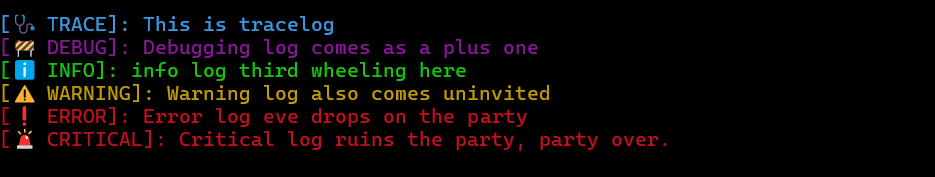

<!--
Dave Logs  
Copyright (c) 2025 Seid Eshetu.

Licensed under the Apache License, Version 2.0 (the "License"). You may not use this file
except in compliance with the License. You may obtain a copy of the License at:

    http://www.apache.org/licenses/LICENSE-2.0

This software is the product of significant time, expertise, and effort invested in its
development, testing, and documentation. While every reasonable measure has been taken to 
ensure its reliability and functionality, it is provided on an "as is" basis, without 
warranty of any kind—express or implied—including, but not limited to, warranties of 
merchantability, fitness for a particular purpose, or non-infringement.

In no event shall the authors or copyright
holders be liable for any claim, damages, or other liability—whether in an action of
contract, tort, or otherwise—arising from, out of, or in connection with the software or
the use or other dealings in the software.
-->


# Dave Logs [🧔‍♂️🪵]
[](https://opensource.org/licenses/Apache-2.0)
[](https://en.cppreference.com/)

**Dave Logs** (a play on Dev Logs) **is a lightweight, thread-safe logging utility designed for C++ development workflows.  It provides a system to inject ergonomic debugging logs that you can strip cleanly from your release builds in a single compile flag no matter how dispersed your debugging logs are through out your code base.** Whether you're debugging embedded systems, writing real-time game engines, working with high performance C++ applications—**Dave Logs keeps your code base clean and tidy without contaminating your translational units with `<iostream>` header and `std::cout` or `std::cerr` statements; which traditionally if forgotten to be deleted later, may stay lurking in your binaries.**

### Features at a glance

- **🎯 Single Macro Control:** Dave Logs can be entirely stripped out at production compile time by defining a single macro-`STRIP_OUT_DAVE_LOGS`. No dangling statements, no forgotten verbosity.
- **🧠 Lightweight & Header-Only:** No build system headaches. A total of 50 lines of code. Just drop in the header and start logging—minimal footprint, maximum clarity.
- **🧵 Thread-Safe Logging:** Built with concurrency in mind, so your logs won’t collide or corrupt when you're running multi-threaded applications.

- **📜Verbose Mode:** optional log metadata toggle for thread ids, filenames, line numbers and function names.

- **🌐 Cross-Platform:** Works wherever C++ works—Linux, Windows, macOS, embedded targets... no special dependencies needed.
- **Emoji & Color Support\*:** Make your logs _pop_ with optional emoji tags and ANSI colors—improves scanning.

> \* works on terminals that offer support for emoji and eoloring.

### What Dave Logs is not
Dave Logs is not a full logging framework with a persistent layer and is not to be used as such. Instead it is a dev-time debugging logs injection system which later can cleanly and throughly be stripped later for your release builds. see note under the [Customization Tips](#customization-tips) section (specifically subsection `log to permanent file`)

## Quick Demo
```cpp
#include "dave_logs/dave_logs.h"

int main(int argc, char const* argv[]) {

	LOG_TRACE("This is trace log")
	LOG_DEBUG("Debugging log comes as a plus one")
	LOG_INFO("info log third wheeling here")
	LOG_WARNING("Warning log also comes uninvited")
	LOG_ERROR("Error log eve drops on the party")
	LOG_CRITICAL("Critical log ruins the party, party over.")

	return 0;
}
```
***
**Output**


<!--  -->


***

**Verbose Mode Output**-Adds thread id, source code filename, line number and function name metadata.

<!--  -->


## Quick Demo-2 (realistic-ish)

The following is not an actual program but a demonstration of how to inject Dave Logs in your application.
```cpp
#include "dave_logs/dave_logs.h"

class ControlBoard {
  public:
	ControlBoard(int b) {
		LOG_TRACE("Constructor called with b = " << b << ", at = " << this);
		if (b < 0)
			throw std::invalid_argument("Negative value not allowed");
        
		/* elapsed_time.start() */
	}

	void setup_config() {
		LOG_DEBUG("Loading configuration files...")

	}

	void connect_to_database() {
		LOG_INFO("Attempting to connect to the database...")


		LOG_WARNING("Connection took longer than expected, retrying...")
	}

	void start_server() {
		LOG_ERROR("Failed to bind to port 8080. Is it already in use?")

		if (/* elapsed_time.get() > */ 30) {
			LOG_CRITICAL("Unable to start server. Exiting application.")
		}
	}

	~ControlBoard() {
		LOG_TRACE("Destructor called for object at " << this)
	}
};

int main(int argc, char const* argv[]) {

	try {
		ControlBoard control_board_one(-1);
	} catch (std::exception& e) {
		LOG_CRITICAL(e.what()) // you may optionally opt to log this permanently.
	}

	ControlBoard ctrl_board_one(5);

	ctrl_board_one.setup_config();
	ctrl_board_one.connect_to_database();
	ctrl_board_one.start_server();

	return 0;
}
```
***
**Output**


***

In both of the demos above, the main takeaway is not the color and emoji embellished outputs—rather the log hygiene and functionality baked into Dave logs design. 

These logs are:
- 🔒 **Thread-safe by default** – ensuring reliability across concurrent environments
- 🧹 **Fully removable in release builds** via the `STRIP_OUT_DAVE_LOGS` definition
- 🪛 **Ergonomically injectable** – designed for seamless inclusion in any C++ codebase without friction or invasive changes
- 💡 **Intentionally integrated to prioritize code maintainability, not cosmetic appeal**

This makes Dave logs an intentional and scalable debugging aid, not just a splash of terminal flair.

## Jump to Section

**[Release History](#release-history) | [Compatibility Overview](#compatibility-overview) | [Installation & Integration](#installation--integration) | [Usage Guide & APIs](#usage-guide--apis)**


**[Enabling Verbose Mode](#enabling-verbose-mode) | [Striping Logs for Production](#striping-logs-for-production) | [Author's Footnotes](#authors-footnotes) | [Customization Tips](#customization-tips)**

**[Build Notes for Demo Executables](#build-notes-for-demo-executables) | [Contributing](#🤝-contributing) | [License](#license) | [Author](#author)** <!-- |  [Change Log](#change-log)  -->


## Release History
* Dave Logs V1.0.0 August 5, 2025. (First Release)

## Compatibility Overview

Dave Logs is built to integrate effortlessly across modern C++ projects, with broad compatibility across tooling and platforms. It uses standard C++ headers and avoids any OS-specific APIs—making it highly portable and easy to embed across diverse environments.

| Category            | Support Details                                                                 |
|---------------------|----------------------------------------------------------------------------------|
| 🧠 C++ Standards     | C++11, C++14, C++17, C++20, C++23                                                |
| 💻 Operating Systems | 🐧 Linux, 🪟 Windows, 🍎macOS , BSD variants, Remote shells (SSH), Embedded OS*   |
| 🔧 Architectures     | x86_64, ARM (32-bit/64-bit), RISC-V, and other platforms supporting std::mutex  |
|

> \*Embedded OS compatibility assumes availability of `std::mutex` and basic terminal output capabilities.  
> For extremely resource-constrained platforms, consider customizing the internal macros to use lightweight alternatives as outlined in the [Customization Tips](#customization-tips) section.

## Installation & Integration
Dave Logs is a near header-only utility with minimal setup and zero dependencies. **There is nothing to be built. Just follow the follwing 5 steps** to drop it into your project and start logging.

**Step 1:** Clone/Download Dave Logs 
```bash
git clone https://github.com/binarystacker/Dave_Logs.git
```
**Step 2:** Copy the directory src/dave_logs from the cloned repository
```
src
 └── dave_logs		# directory to be copied to your project
	  ├── dave_logs.cpp	
	  └── dave_logs.h        
```
Copy the entire `dave_logs/` directory to your preferred location inside your project.

**Step 3:** Include `dave_logs/dave_logs.h` in any translational unit. 

```cpp
#include dave_logs/dave_logs.h
```
This header may be included as many times in various translational units as needed with no extra configuration or special arrangement.

**Step 4:** Inject Dave Logs in lines you desire 

```cpp
LOG_INFO("Informational message");
```
Check [APIs & Usage Guide](#apis--usage-guide) for more patterns how to compose log messages.

**Step-5** Link against `dave_logs.cpp`

Make sure your build system (CMake, Makefile, or IDE project settings) compiles and links `dave_logs.cpp` alongside your own code.

**Additional Options** 
- Define `VERBOSE` to enable verbose mode logging. Check more details in [Enabling Verbose Mode ](#enabling-verbose-mode) section.
- Define `STRIP_OUT_DAVE_LOGS` to strip logs during production. Check more details in [Striping Logs for Production](#striping-logs-for-production) section.


<!-- Technically speaking you could build Dave Logs as a static or dynamic library and link your projects to it but you don't wanna do that. The whole point of Dave Logs is to be used as a dev time tool not integral part of your software


plus keeping it this way you could easily customize colors
customize change up / delete emojis by editing dave_logs.h file instead of being stuck with a binary

 -->

## Usage Guide & APIs

Available log apis: 6 readily available apis plus 1 custom logging api.

```cpp
// Readily available macro apis
LOG_TRACE("some trace log")
LOG_DEBUG("some debugging log")
LOG_INFO("some info log")
LOG_WARNING("some warning log")
LOG_ERROR("some error log")
LOG_CRITICAL("some critical log.")

// Custom logging api
// LOG(color, level, your-log-composition)
LOG(BLUE, "MyTag", "Custom styled log");
```
for the custom logging api color argument is one of the readily available color definitions that ship with the standard distribution: **BLACK, RED, DARK_GREEN, ORANGE, BLUE, PURPLE, LIGHT_BLUE, WHITE and GREEN**

**log composition:** Zero or more number of arguments may be passed to the macro. Use `<<` to stream multiple values in one macro.

```cpp
// log composition
LOG_TRACE("Constructor called with b = " << b << ", at = " << this)
```
see [Quick Demo-2](#quick-demo-2-realistic-ish) above for demonstration

**No need to end with semicolon:** It is not mandatory to end the macro calls with ;. (Doing so will not cause havoc but still don't do it. Why? when logs are stripped out at release build you will be left with a free standing semicolon ... even if that by itself is harmless just don't do it)

**Loggable data types:** Dave logs internally uses standard library `std::cout` to log to terminal. Hence any data type loggable with `std::cout` works here. (string types, number types, booleans etc...)

**Log line coloring:** compatible with **Linux/macOS Terminal**, **Windows Terminal / PowerShell**, **SSH / Remote shells**. More in [Customization Tips](#customization-tips) section on how to turn off coloring.

By default Dave Logs ships with the following color theme
- TRACE logs print in BLUE color
- ERROR and CRITICAL logs print in RED color
- DEBUG logs print PURPLE color
- INFO logs print GREEN color
- WARNING logs print ORANGE or yellow color

You may customize these theme and expand your color pallet as explained in the [Customization Tips](#customization-tips) section. Although I must say doing so is just cosmetic over engineering and does not contribute a tangible value to the core functionality of Dave Logs. The option is just included for completeness and open ended optionality for use at users discretion.

## Enabling Verbose Mode

Verbose may be activated for logs by defining `VERBOSE`

**By default Verbose mode is off.**

Verbose mode enables printing detailed logs including: Thread ID, Source filename, line number & function name. click <a href="assets/basic_demo_verbose_screenshot.png" target="_blank">here </a> for visual demo of how a verbose mode output looks like. 

Check the [Customization Tips](#customization-tips) section on how to customize information enabled in verbose mode.


**Enabling Verbose Mode Globally**

You may define `VERBOSE` in the file `dave_logs.h`

```cpp
//file: dave_logs.h
#pragma once

#define VERBOSE	//> define VERBOSE here

#ifndef STRIP_OUT_DAVE_LOGS

// Rest of dave_logs.h content

```

One more ("less productive") way to define `VERBOSE` is to pass it as a flag to your compiler via your build system. (one example for cmake is to include the line either ***add_compile_options(-DFLAG)*** or ***add_definitions(-DVERBOSE)*** in your cmake script or define `VERBOSE` when running CMake via the command => ***cmake -DCMAKE_CXX_FLAGS="-DVERBOSE" ..)***. 

Although the second way technically works i have labeled it as **less productive** because this necessitates the rebuild of all unchanged translational units every time you want to switch back and forth to verbose and non verbose mode


**Enabling Verbose Mode for a Specific Translation Unit**

You may define `VERBOSE` just before the line `#include "dave_logs/dave_logs.h"` in your particular translation unit.
```cpp
//file: dave_logs.h
//---
#define VERBOSE
#include "dave_logs/dave_logs.h"

//--- Rest of your translation unit content

```
## Striping Logs for Production

When it’s time to compile for release, remove all Dave Logs by defining `STRIP_OUT_DAVE_LOGS`.

```cpp
//file: dave_logs.h

#pragma once

#define STRIP_OUT_DAVE_LOGS //> define STRIP_OUT_DAVE_LOGS here

#ifndef STRIP_OUT_DAVE_LOGS

//--- Rest of dave_logs.h content

```
You could also go ahead and directly pass the flag `STRIP_OUT_DAVE_LOGS` to your compiler via your build system to achieve the same.

NOTE: Under the hood Dave Logs achieves stripping out logic via native preprocessor directives. I.e. Dave Logs are not physically removed from your source files ... they are just guaranteed not to end up in your binaries.  If it is needed to physically remove these lines you may use extra command line utilities such as grep to physically remove lines that begin with "LOG_" and end with ")"

## Interaction of `STRIP_OUT_DAVE_LOGS` and `VERBOSE`

In the case both `STRIP_OUT_DAVE_LOGS` and `VERBOSE` are defined `STRIP_OUT_DAVE_LOGS` overrides `VERBOSE`. I.e. if `STRIP_OUT_DAVE_LOGS` is defined `VERBOSE` has no effect and all logs are stripped out.

## Author's Footnotes

Like it or not `std::cout` logs are an integral part of developing your software. They are your only window to take a sneak peak at what the code you wrote is doing under the hood and the only channel your software communicates back to you what its doing in a human readable form. They're helpful in chasing down that persistent bug or which execution path is your code taking. But before you know it these logs are untraceably everywhere so much so that cleaning them up one by one later is a nightmare, even if you have done so there is always some feeling that you are not too sure that you haven't left a couple out there. Forgotten `std::cout` calls, cerr bombs, and deep diagnostic trails can become costly residues in production binaries. 

Dave Logs steps in with a clean and pragmatic logging solution: structured expressive macros, zero runtime impact in release builds, thread safety you don’t have to think twice about and it doesn’t ask you to remember logging hygiene.

### Why Dave Logs?
In the authors view; working on a C++ codebase with out Dave Logs (or at least not implementing a work flow which is in features similar to Dave Logs), is no short equivalent to going ahead and changing the dirty oil in your car with no rubber gloves on. You could go ahead and do it thinking you could just wash it off later when your done but IT IS MESSY and your hands will never be as clean as if you had worn gloves on. Dave Logs hands you not just a glove but a full blown head to toe PPE.

### Architecture Summary
The entire code base of Dave Logs is a total of 50 lines (counting line breaks as originally authored by the author and not counting empty/comment lines). Of these 50 lines 46 live in dave_logs.h header file and the remaining 4 in dave_logs.cpp file. So technically speaking Dave Logs is not a header only library.

A close look at the Dave Log's code base reveals that Dave Logs achieves what its set out to do by first "thread safing" the standard output std::cout using std::mutex then adds a bit of line coloring and emoji sprinkle and finally wrapping this via pragmatically structured macros for ergonomic logging and easy striping later when they are no longer needed.

It is entirely built using resources found in the preprocessor and standard C++ library.  No other magic no other dependency.

### Library Naming

This section is to clear up the half obvious and half not so obvious naming. This is your confirmation that yes indeed the name Dave Logs is a pun for dev. logs and no Dave is not a lumberjack and he doesn't have any thing to do with wooden logs.

### Subsequent works
[to be announced]

## Customization Tips
You may edit the `src/dave_logs/dave_logs.h` file to customize the standard distribution as needed in the following ways.

**Color customization:** you may rearrange the default colors assigned to log levels as needed

**Color pallet expansion:** The standard distribution of Dave Logs ships with predefined macros for 4-bit ANSI Color Codes. You may expand this color pallet by defining your own custom colors using 

1. 256-Color ANSI Escape Codes as
```cpp
// Foreground (text) color
\033[38;5;<n>m

// Background color
\033[48;5;<n>m
```
Replace \<n\> with a number from 0 to 255. Example: `#define BRIGHT_RED \033[38;5;196m` // gives you bright red text

2. True-Color (24-bit RGB) ANSI Escape Codes
```cpp
// Foreground (text) color
\033[38;2;<r>;<g>;<b>m

// Background color
\033[48;2;<r>;<g>;<b>m
```
Replace \<r\>, \<g\>, \<b\> with values from 0 to 255. Example: `#define HOT_PINK \033[38;2;255;105;180m` // gives you hot pink text

**Verbose mode detail customization:** You may opt to print less info in verbose mode by selectively commenting out the specific detail you want to turn off in the `#ifdef VERBOSE` section of `dave_logs.h`.
The following example comments out the Thread ID printing line which will turn off thread id printing in verbose mode. Similarly you may comment out the file and or function printing line to turn them off in verbose mode.
```cpp
// file: dave_logs.h
//---
#ifdef VERBOSE
		#define LOG(color, level, ...)                                   \
			out_mutex.lock();                                            \
			std::cout << color << level << __VA_ARGS__ << RESET << '\n'  \
					  /*<< "[Thread-" << std::this_thread::get_id() << "]" \*/
					  << "[ file: " << __FILE__ << ":" << __LINE__       \
					  << " | function: " << __func__ << " ]\n"           \
					  << std::endl;                                      \
			out_mutex.unlock();

	#else
//---
```
In contrast to you may also add any other meta data say like time stamps via std::chrono for logs. Although as I said earlier the moment we are doing that we are entering the over engineering territory unless the user has found it absolutely necessary and vital to his specific use case.

**Emoji Deletion**: in the case your terminal doesn't support emojis you may opt to surgically remove them from the convenience macro wrappers section of `dave_logs.h` as follows
```cpp
// file: dave_logs.h
//---
	#define LOG_TRACE(...) LOG(LIGHT_BLUE, "[TRACE]: ", __VA_ARGS__)
	#define LOG_DEBUG(...) LOG(PURPLE, "[DEBUG]: ", __VA_ARGS__)
	#define LOG_INFO(...) LOG(GREEN, "[INFO]: ", __VA_ARGS__)
	#define LOG_WARNING(...) LOG(ORANGE, "[WARNING]: ", __VA_ARGS__)
	#define LOG_ERROR(...) LOG(RED, "[ERROR]: ", __VA_ARGS__)
	#define LOG_CRITICAL(...) LOG(RED, "[CRITICAL]: ", __VA_ARGS__)
//---
```
**Turning off colored logs** Similarly in cases where your terminal doesn't support ANSI color sequences; you may also disable log coloring by commenting out what the color definitions expand to as follows
```cpp
// file: dave_logs.h
//---
	#define RESET /*"\033[0m"*/
	#define BLACK /*"\033[30m"*/
	#define RED /*"\033[31m"*/
	#define DARK_GREEN /*"\033[32m"*/
	#define ORANGE /*"\033[33m"*/
	#define BLUE /*"\033[34m"*/
	#define PURPLE /*"\033[35m"*/
	#define LIGHT_BLUE /*"\033[36m"*/
	#define WHITE /*"\033[37m"*/
	#define GREEN /*"\033[38m"*/
	#define COLORLESS
//---
```

**log to permanent file** You can technically replace std::cout with an std::fstream object and turn Dave Logs to a some how "low budget permanent logging system" but this contradicts with the intended design of Dave Logs being a development time tool and console out put just suffices to achieve that. Plus there are a whole range of persistent logging system libraries (Boost, spdlog, log4cpp etc...) with more robustness and customizability than a "moded" Dave Logs.

<!-- ## More Usage Patterns, Customizations and  Code Templates -->

## Build Notes for Demo Executables

It has been made clear that Dave Logs does not need to be pre built to be used yet it ships with a couple of demo source codes under the `demos` directory. These may be built using the cmake script distributed in this repo.

## 🤝 Contributing
Dave Logs welcomes contributions from fellow developers who care about performance, clarity, and clean code base. Whether you’re fixing typos, optimizing macros, or improving build scripts your help is welcome.

**Ways to Contribute**
-  More usage patterns and examples
-  Help with documentation—tutorials, explanations, or better README vibes
-  Report bugs or edge cases
-  Propose new features

**Contribution Guidelines**

1. Fork the repo and create your branch:

```bash
git checkout -b feature/your-idea
```
2. Make your changes; when you do so stick with the capitalization choice of the original code base. snake_case for variables and function names, PascalCase for class and enum names, ALL_CAPS for constants.
3. Submit a pull request with a clear description of what you added or fixed.

## License
Dave Logs is distributed under the permissive, and developer-friendly Apache 2.0 license — free for personal, academic, and commercial use in compliance with the license.

## Author
Dave Logs is written by a solo developer with a passion for efficient systems design, performance engineering, and clean code base.  

**👤Contact:**
	
Seid Eshetu
- Email: emailbinarystacker@gmail.com
- Telegram: [t.me/sironcler](t.me/binarystacker)
- Zoom: emailbinarystacker@gmail.com